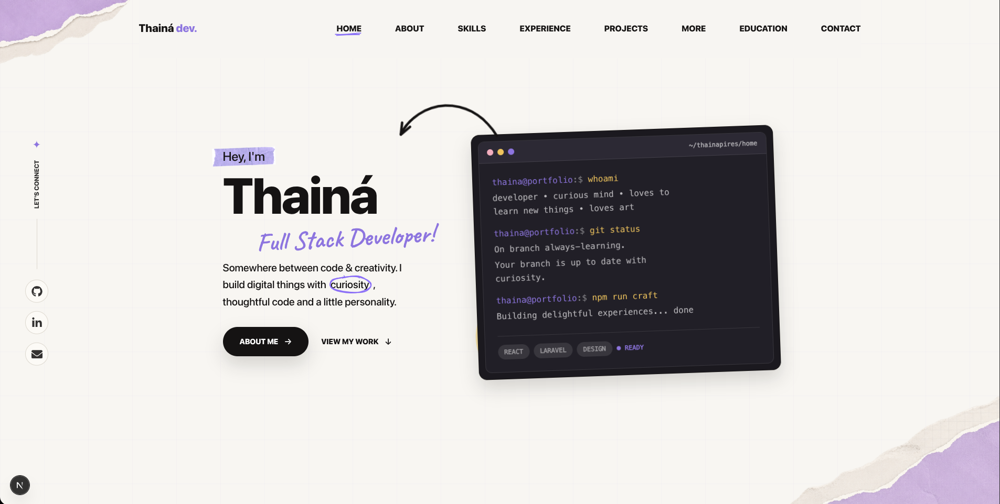

# Portfolio Thainá Pires



Esse é o meu portfólio pessoal, que criei para reunir um pouco sobre mim, minha trajetória como desenvolvedora, as tecnologias com que trabalho, projetos, formação e também algumas coisas que gosto fora do código.

Desenvolvi o projeto com Next.js, React, TypeScript e Tailwind CSS, aproveitando também para explorar bastante UI, responsividade e alguns detalhes de interação.

Quis fugir um pouco daquele visual mais tradicional de portfólio de desenvolvedor e trazer mais de mim para o projeto. Amo arte e queria que isso aparecesse também no design, então segui uma proposta mais artesanal, usando recortes, rabiscos, marcações, fotos e elementos que lembram colagens.

Também integrei minhas contribuições do GitHub e GitLab em um único gráfico, para conseguir representar melhor minha atividade tanto em projetos pessoais quanto profissionais.

## Preview

O portfólio está publicado na Vercel:

[thaina-pires.vercel.app](https://thaina-pires.vercel.app)


## Stack

- Next.js 16
- React 19
- TypeScript
- Tailwind CSS 4
- Motion
- Lucide React
- React Icons
- React Rough Notation

## O que tem por aqui

O portfólio é uma single page dividida em seções que contam um pouco sobre mim e sobre minha trajetória:

- Página única com navegação por seções.
- Hero com apresentação pessoal.
- Seção sobre mim.
- Stack técnica principal e ferramentas complementares que uso.
- Experiência profissional.
- Projetos em destaque.
- Formação acadêmica e certificações.
- Hobbies e interesses pessoais.
- Contato.
- Gráfico de contribuições combinando GitHub e GitLab.

Os dados de contribuição são carregados no servidor e revalidados a cada 6 horas.

## Estrutura do projeto

A estrutura principal está organizada dessa forma:

```text
app/
  globals.css          Estilos globais da aplicação
  layout.tsx           Layout raiz e metadados
  page.tsx             Página inicial

components/
  portfolio/           Seções e componentes específicos do portfólio
  ui/                  Componentes reutilizáveis de interface

data/
  portfolio.ts         Conteúdo principal do portfólio

lib/
  contributions.ts     Integração com GitHub e GitLab

public/
  images/              Imagens, ilustrações e assets visuais
```

## Desenvolvimento local

O projeto usa Node.js e npm. No ambiente local, as dependências são instaladas com:

```bash
npm install
```

O servidor de desenvolvimento roda com:

```bash
npm run dev
```

O build de produção pode ser gerado com:

```bash
npm run build
```

e executado localmente com:

```bash
npm run start
```

Também deixei um script separado para checagem do TypeScript:

```bash
npm run typecheck
```

## Variáveis de ambiente

O gráfico de contribuições depende de alguns dados externos. No ambiente local, eles ficam definidos em `.env.local`:

```text
GITHUB_USERNAME=thainapires
GITHUB_TOKEN=

GITLAB_USERNAME=thainapires
GITLAB_BASE_URL=https://gitlab.com
```

### GitHub

As contribuições do GitHub são carregadas pela API GraphQL, usando `GITHUB_TOKEN` para autenticação.

Quando o token não está disponível, o restante do portfólio continua funcionando e o GitHub é tratado como uma fonte indisponível no gráfico.

### GitLab

No GitLab, os dados vêm do calendário público do perfil, então essa integração não depende de token. A fonte utilizada atualmente é:

```text
https://gitlab.com/users/thainapires/calendar.json
```

Caso ela não esteja disponível, o gráfico continua sendo renderizado apenas com as fontes que responderam.

## Organização do conteúdo

Para evitar deixar informações pessoais espalhadas pelos componentes, grande parte do conteúdo do portfólio está centralizada em:

```text
data/portfolio.ts
```

É ali que ficam dados como:

- Links sociais.
- Itens de navegação.
- Stack técnica.
- Projetos em destaque.
- Destaques profissionais.
- Experiências.
- Formação.
- Certificações.
- Hobbies.
- Informações de contato.

Os componentes consomem esses dados para montar as diferentes seções da página. Os assets visuais ficam principalmente em:

```text
public/images/
```

Os metadados gerais da página, como título, descrição e idioma, ficam em:

```text
app/layout.tsx
```

E os estilos globais, tokens e configurações visuais compartilhadas ficam concentrados em:

```text
app/globals.css
```

## Projetos em destaque

Alguns dos projetos que aparecem atualmente no portfólio são:

- **Bom dia Dev**: dashboard pessoal que criei para acompanhar merge requests no GitLab, carga de code review e minha atividade diária de desenvolvimento.
- **Git Fusion**: ferramenta para juntar contribuições do GitHub e GitLab em um único gráfico interativo.

- **Schedulynx**: aplicação de agendamento integrada ao Google Calendar para permitir reservas de horários.

## Deploy

O portfólio está hospedado na Vercel e usa o fluxo padrão de deploy para projetos Next.js.

A configuração atual segue basicamente:

- Framework: Next.js
- Build command: `npm run build`
- Output directory: padrão do Next.js

As variáveis de ambiente usadas pelo gráfico de contribuições também ficam configuradas no ambiente da Vercel.

## Contato

- GitHub: [github.com/thainapires](https://github.com/thainapires)
- LinkedIn: [linkedin.com/in/thainapires](https://www.linkedin.com/in/thainapires)
- Email: [thainapires.dev@gmail.com](mailto:thainapires.dev@gmail.com)
